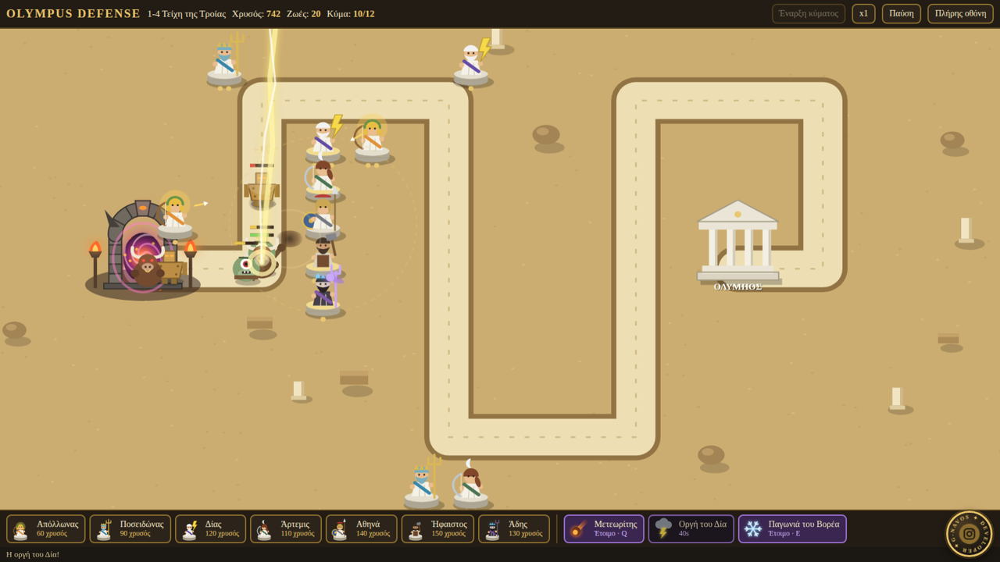
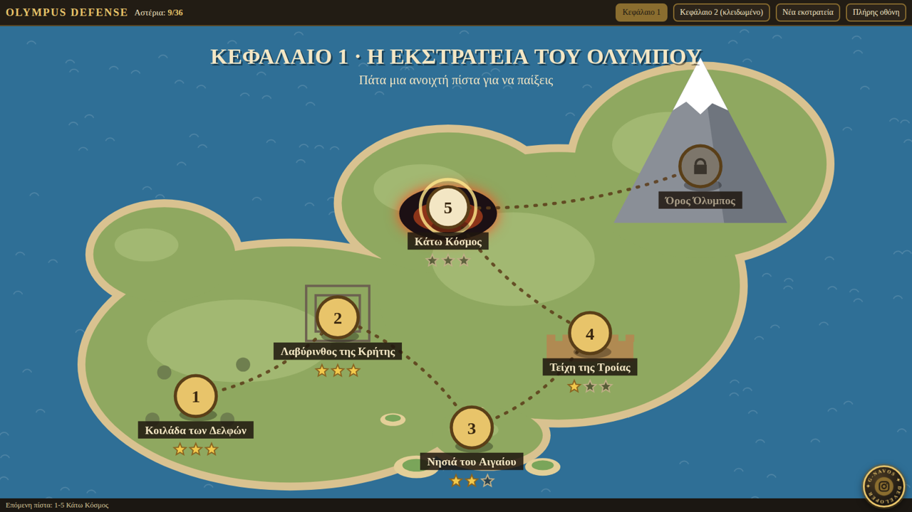
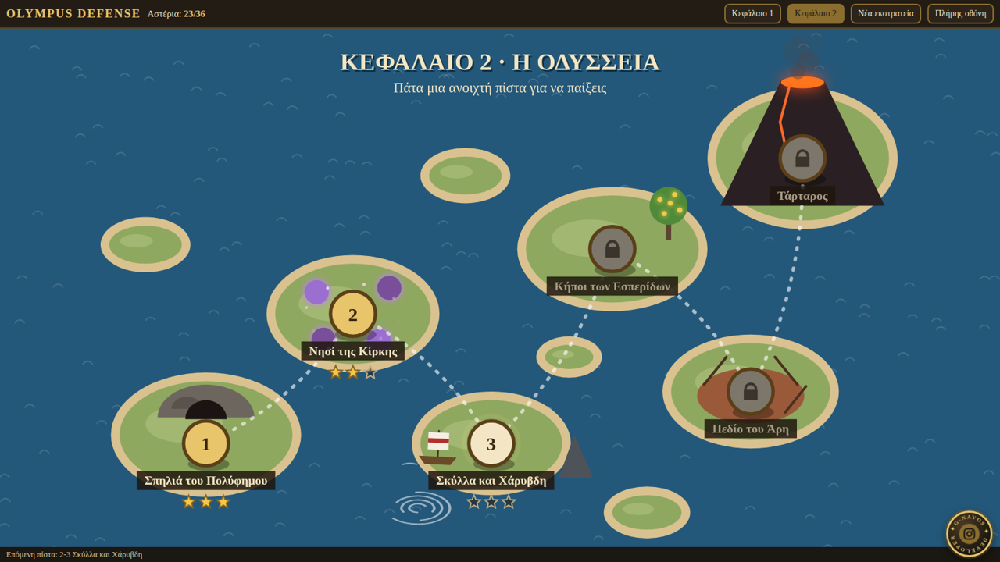

# Olympus Defense

A tower defense game set in Greek mythology, playable in the browser on desktop and mobile.

**[▶ Play it live](https://olympus-defense.onrender.com)**



## About

Monsters pour out of the Gates of Tartarus and march toward Mount Olympus. You hold the road by placing gods along it, each with their own way of fighting: Zeus chains lightning between enemies, Poseidon slows everything around him, Athena buffs nearby allies, and so on.

The game is written in plain JavaScript on an HTML5 Canvas, with no frameworks, libraries or image assets. Every character, map and effect is drawn in code.

## Features

- **Campaign with 12 levels in 2 chapters.** Chapter 1 goes from Delphi to Mount Olympus. Chapter 2, *The Odyssey*, unlocks once Chapter 1 is cleared.
- **7 gods to build and upgrade.** Some are unlocked as you progress through the campaign.
- **3 active powers:** Meteor, Wrath of Zeus and Boreas' Frost, cast directly onto the road.
- **8 enemy types with their own mechanics.** Armored Talos, Medusa's petrifying gaze, the regenerating Hydra, and Cerberus, who enrages at half health.
- **4 difficulty levels and a 3-star rating** for every level. Progress is saved locally.
- **Responsive layout** that fills any screen and switches to a side panel in mobile landscape.
- **Keyboard shortcuts:** `1`–`7` gods, `Q` `W` `E` powers, `Space` next wave, `P` pause.

## Screenshots

| Campaign map | Chapter 2: The Odyssey |
|---|---|
|  |  |

## Tech stack

| | |
|---|---|
| Language | Vanilla JavaScript (ES6+) |
| Rendering | HTML5 Canvas 2D API, fully procedural graphics |
| UI | HTML5 and CSS3 (Flexbox, `clamp()`, safe-area insets, media queries) |
| Storage | `localStorage` for campaign progress and stars |
| APIs | Fullscreen API, Screen Orientation API, Pointer Events |
| Hosting | Render (static site) |

No build step and no dependencies: the whole game is a single `index.html`.

### Technical notes

- Fixed 960×600 logical world, scaled to any viewport with `devicePixelRatio` support so it stays sharp on retina and mobile screens.
- Delta-time game loop on `requestAnimationFrame`, with a 1×/2×/3× speed option.
- Data-driven design: levels, gods, enemies and powers are plain config objects, so adding content means adding data rather than new logic.
- Path-based placement validation and enemy movement using point-to-segment distance math.
- Balance was tuned with a scripted bot that plays through every level headlessly (Playwright).

## Run locally

```bash
git clone https://github.com/G-Developerr/Olympus-Defense.git
cd Olympus-Defense
# open index.html in your browser, or serve it:
npx serve .
```

## Author

**Jim Tzinavos** (G-navos Developer), Lamia, Greece

[Portfolio](https://g-developerr.github.io/Portfolio/) · [LinkedIn](https://www.linkedin.com/in/jim-tzinavos-b73370350) · [Instagram](https://www.instagram.com/mhtsos_tzinavos/)
