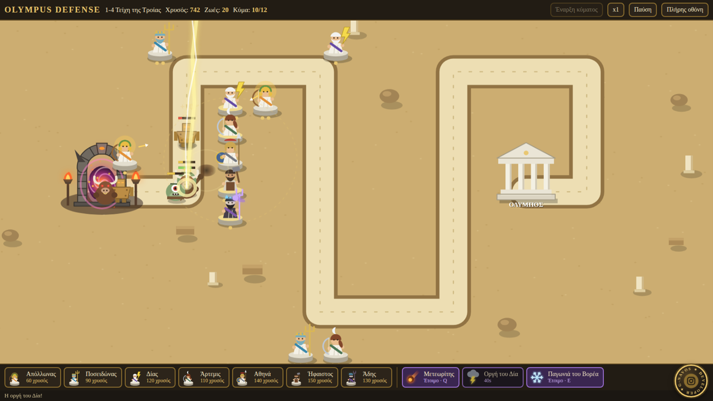
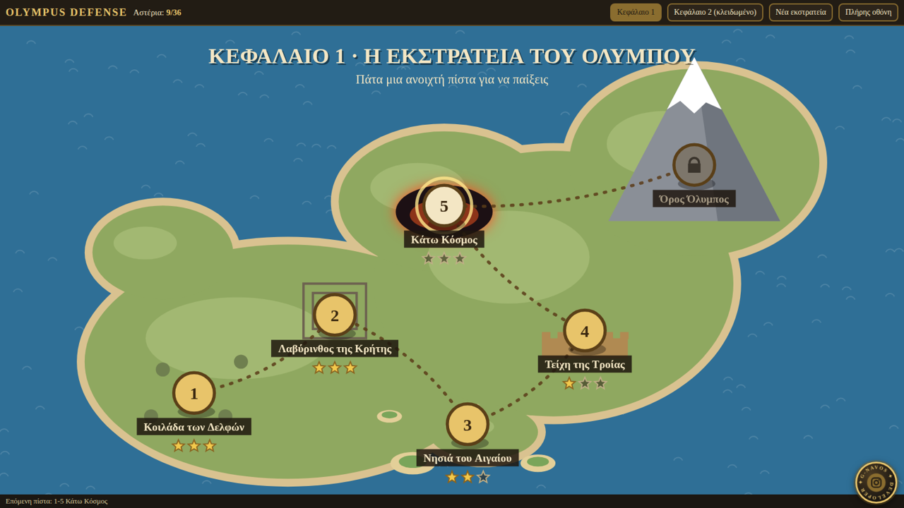
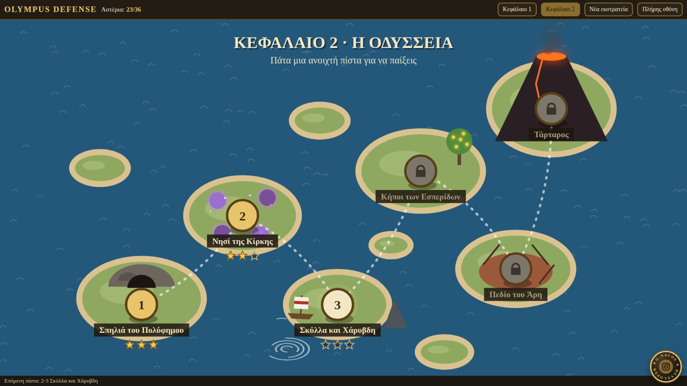

# Olympus Defense

A tower defense game set in Greek mythology, playable in the browser on desktop and mobile.

**[▶ Play it live](https://olympus-defense.onrender.com)**



## About

Monsters pour out of the Gates of Tartarus and march toward Mount Olympus. You hold the road by placing gods along it, each with their own way of fighting: Zeus chains lightning between enemies, Poseidon slows everything around him, Athena buffs nearby allies, and so on.

The game is written in plain JavaScript on an HTML5 Canvas, with no frameworks, libraries or image assets. Every character, map and effect is drawn in code.

## Features

- **Title screen and story.** An animated Olympus title screen, plus a short story on parchment with typewriter text at the start of every chapter and an epilogue at the end.
- **Campaign with 30 levels in 5 chapters.** The chapters are the Olympus campaign, *The Odyssey*, *The Argonauts*, *The Labours of Heracles* and *The Titanomachy*. Each chapter has its own world map and unlocks when the previous one is cleared.
- **7 gods to build and upgrade.** At level 3 each god branches into one of two specializations. For example, Zeus becomes either *Storm*, with a wider chain, or *Thunderbolt*, with heavy single-target strikes.
- **A controllable hero.** Heracles fights on the road, blocks monsters, levels up and respawns when he falls.
- **3 active powers:** Meteor, Wrath of Zeus and Boreas' Frost, cast directly onto the road.
- **14 enemy types with their own mechanics:**
  - flying Stymphalian birds that only archers can hit;
  - shades that stay invisible unless they are near Athena;
  - Spartoi that split in two when they die;
  - bosses such as Cerberus, the Hydra and Kronos.
- **Skill tree.** Spend the stars you earn on permanent upgrades to damage, gold, lives, powers and the hero.
- **Level challenges.** Each level has an optional rule, such as "no powers", "only certain gods" or "3 lives". Beating the level under that rule earns an extra star.
- **Endless mode with a leaderboard.** Fight ever-stronger waves with bosses every 5 waves, then save your best runs.
- **English and Greek.** Switch language at any time from the top bar.
- **Wave timer with early-call bonus.** Call the next wave early for extra gold.
- **4 difficulty levels and a 3-star rating** for every level. Progress is saved locally.
- **Responsive layout** that fills any screen and switches to a side panel in mobile landscape.
- **Installable PWA.** Add it to your home screen for fullscreen, landscape play that also works offline.
- **Procedural audio.** The music is an ancient-Greek-style choir chant over a drone, and every god, power and boss has its own sound effects. All of it is synthesized live with the Web Audio API, and music and effects can each be switched off.
- **Keyboard shortcuts:**
  - `1`–`7` gods, `Q` `W` `E` powers, `H` hero, `U` upgrade;
  - `Space` next wave, `P` pause, `M` mute.

## Screenshots

| Campaign map | Chapter 2: The Odyssey |
|---|---|
|  |  |

## Tech stack

| | |
|---|---|
| Language | Vanilla JavaScript (ES6+) |
| Rendering | HTML5 Canvas 2D API, fully procedural graphics |
| UI | HTML5 and CSS3 (Flexbox, `clamp()`, safe-area insets, media queries) |
| Storage | `localStorage` for progress, stars, skills and the leaderboard |
| PWA | Web App Manifest and a network-first Service Worker |
| Audio | Web Audio API, fully synthesized (formant choir, drone, SFX), no audio files |
| APIs | Fullscreen API, Screen Orientation API, Pointer Events |
| Hosting | Render (static site) |

No build step and no dependencies: the whole game is a single `index.html`, plus a manifest, a service worker and icons for the PWA.

### Technical notes

- Fixed 960×600 logical world, scaled to any viewport with `devicePixelRatio` support so it stays sharp on retina and mobile screens.
- Delta-time game loop on `requestAnimationFrame`, with a 1×/2×/3× speed option.
- Data-driven design: levels, gods, enemies and powers are plain config objects, so adding content means adding data rather than new logic.
- Path-based placement validation and enemy movement using point-to-segment distance math.
- Balance was tuned with a scripted bot that plays through every level headlessly (Playwright).

## Run locally

```bash
git clone https://github.com/G-Developerr/Olympus-Defense.git
cd Olympus-Defense
# open index.html in your browser, or serve it:
npx serve .
```

## Author

**Jim Tzinavos** (G-navos Developer), Lamia, Greece

[Portfolio](https://g-developerr.github.io/Portfolio/) · [LinkedIn](https://www.linkedin.com/in/jim-tzinavos-b73370350) · [Instagram](https://www.instagram.com/mhtsos_tzinavos/)
